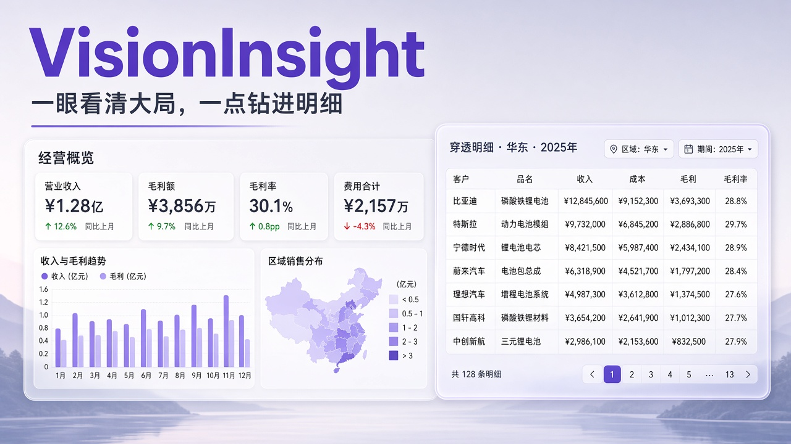
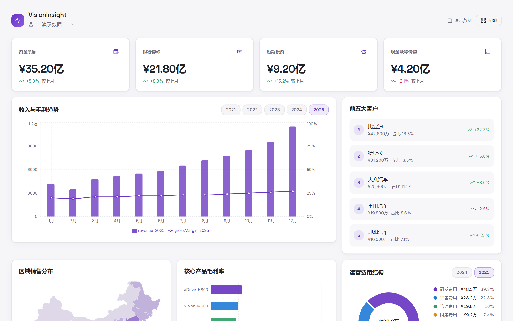
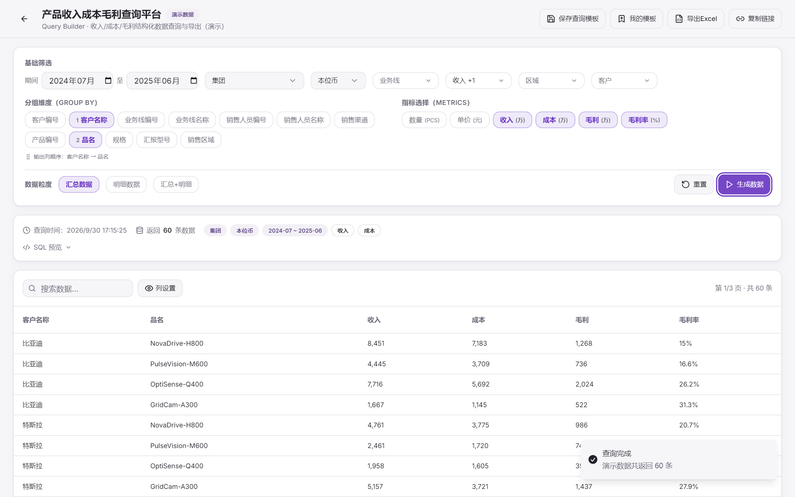
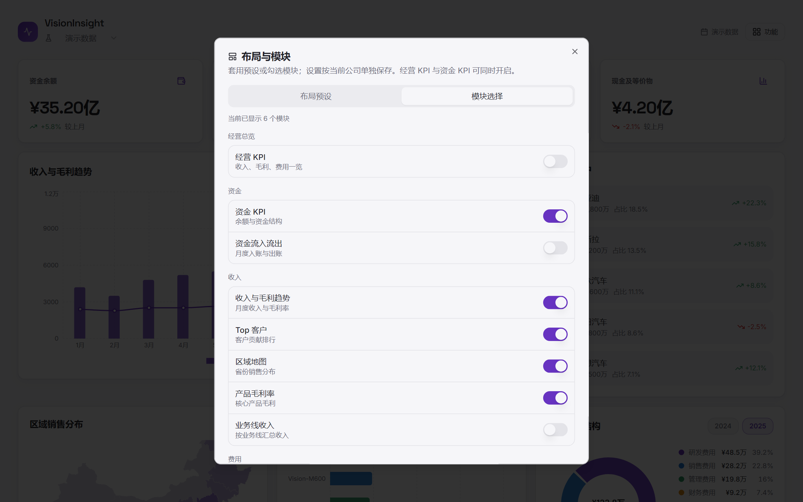

# VisionInsight

开源经营与财务 BI：**看板概览 + 图表穿透明细**。按公司上传数据、清洗映射，老板看图，分析师查数。



远程仓库：[https://github.com/cody999110/vision-biz-dash](https://github.com/cody999110/vision-biz-dash)

## 效果预览

| 经营看板概览 | 图表穿透 · BI 明细查询 | 布局与模块编排 |
|:---:|:---:|:---:|
|  |  |  |

**亮点简述**

- **图表看大局**：资金 / 收入 / 费用 / 区域一张首页看清，支持多年对比  
- **点击看明细**：看板图表可穿透进入 Query Builder，按维度/指标自由查询、导出  
- **布局可编排**：预设画廊 + 模块勾选，按公司记住首页组合  

开源经营与财务 BI 的本质：**既服务老板一眼概览，也能让人钻进业务明细把账算清楚。**

## 一键启动（Windows）

**不要双击** `start.ps1`（窗口容易一闪而过，且旧版 Windows PowerShell 对无 BOM 的 UTF-8 脚本易报错）。

在项目根目录打开 **PowerShell** 或 **终端**，执行：

```powershell
cd "d:\工作文档\编程\axera_dashboard"
powershell -ExecutionPolicy Bypass -File .\start.ps1
```

会自动打开两个窗口：
1. 后端 `http://127.0.0.1:8000`（文档 `/docs`）
2. 前端 `http://127.0.0.1:8080`

看到前端窗口出现 `Local: http://localhost:8080/` 后，用浏览器打开即可。

## 使用 Campaign 上传数据

1. 打开前端看板 http://127.0.0.1:8080
2. 右上角切换「数据视图」：演示数据 / 已上传公司
3. 点击 **功能 → Campaign 数据** 或空态卡片上的「下载模板 / 上传数据」
4. 填写公司名称 → 选择数据域 → 下载模板 → 上传 CSV
5. 上传后进入**清洗预览**：核对映射变更，确认后才入库
6. 确认成功后顶部自动切换到该公司；未上传的数据域显示空态

## 数据清洗（按公司）

1. **功能 → 数据清洗**，切换到目标公司
2. 配置维度映射（如「集团」→「集团总部」、业务线/科目别名统一）
3. 保存后，之后上传会自动套用；也可对已入库数据点「重新清洗」

结构规范化（日期/数值/去空格/空行）在上传时自动执行；业务映射类似 Power Query 的「替换值」。原始行会保留在 `raw_rows`，便于回溯。

## 示例 CSV

- `backend/samples/sample_revenue.csv` — 收入成本样例
- `backend/samples/sample_expense.csv` — 费用样例

## 手动启动

```powershell
# 后端
cd backend
.\.venv\Scripts\uvicorn.exe app.main:app --reload --port 8000

# 前端（新终端）
cd vision-biz-dash-main
npm run dev
```

前端通过 Vite 代理 `/api` → 后端，无需额外 CORS 配置。

## 仓库说明

本项目为 monorepo 结构：
- `vision-biz-dash-main/` — 前端（Vite + React）
- `backend/` — 后端（FastAPI）
- `docs/` — 设计文档与截图
- `start.ps1` — 一键启动脚本

重新截取 README 效果图（需本地前后端已启动）：

```powershell
cd vision-biz-dash-main
node scripts/capture-readme-shots.mjs
```
